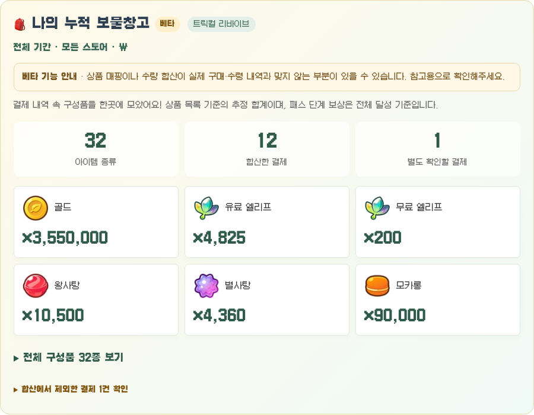
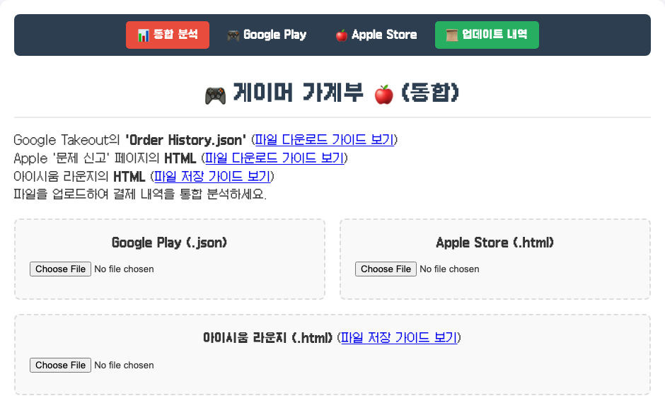
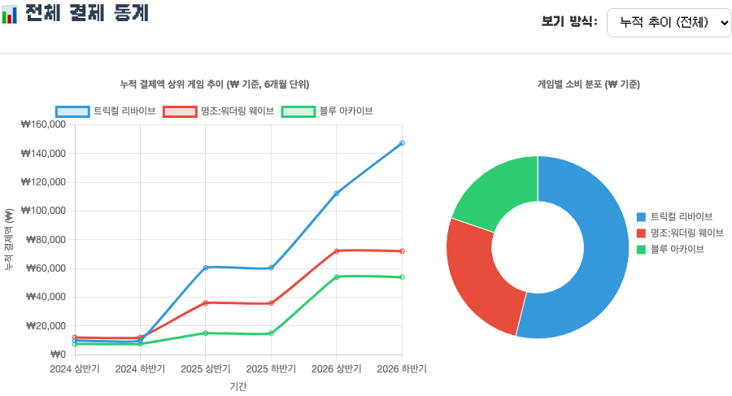

<div align="center">

<h1>🎮 게이머 가계부</h1>
<p><strong>얼마를 썼는지, 어떤 구성품을 모았는지 한눈에.</strong><br>Google Play · Apple Store · 아이시움 라운지의 결제 내역을 한곳에서 확인하세요.</p>

<p>
  
  
  
</p>

<p>
  <a href="https://ghsgkq.github.io/Gamer-Expense-Tracker/"><strong>🚀 바로 사용하기</strong></a>
  &nbsp;·&nbsp;
  <a href="#시작하기">사용 방법</a>
  &nbsp;·&nbsp;
  <a href="https://github.com/ghsgkq/Gamer-Expense-Tracker">GitHub</a>
  &nbsp;·&nbsp;
  <a href="mailto:ckdgus5820@gmail.com">문의·오류 제보</a>
</p>

</div>

---

여러 스토어에 흩어진 결제 내역을 파일로 불러오면 **게임별 지출, 월별 변화, 전체 소비 분포**를 확인할 수 있습니다. 트릭컬 리바이브에서는 패키지의 **구성품·아이콘**을 펼쳐 보고, **나의 누적 보물창고**에서 아이템별 합계도 살펴볼 수 있습니다.

**[미리보기](#미리보기) · [주요 기능](#주요-기능) · [트릭컬 전용 기능](#트릭컬-전용-기능) · [개인정보](#개인정보-처리) · [개발 안내](#개발-및-데이터-관리)**

## 미리보기

**🎒 패키지 속 구성품을 모아 보는 나의 누적 보물창고**



> 아래 화면을 포함한 README의 스크린샷은 **가상 결제 데이터**로 만든 예시입니다. 실제 개인 결제 파일을 사용하지 않았습니다.

<details>
<summary><strong>📊 파일 업로드와 결제 통계 화면도 보기</strong></summary>

<br>

**세 가지 스토어의 파일을 한 페이지에서 불러오기**



**게임별 지출 흐름과 소비 분포 비교하기**



</details>

## 시작하기

별도의 회원가입이나 설치 없이 [웹에서 바로 사용](https://ghsgkq.github.io/Gamer-Expense-Tracker/)할 수 있습니다.

| 결제 내역 | 준비할 파일 | 저장 방법 |
| --- | --- | --- |
| 🎮 Google Play | Google Takeout의 `Order History.json` | [다운로드 가이드](https://ghsgkq.github.io/Gamer-Expense-Tracker/guide/guide.html) |
| 🍎 Apple Store | Apple ‘문제 신고’ 페이지의 `.html` 또는 `.htm` | [페이지 저장 가이드](https://ghsgkq.github.io/Gamer-Expense-Tracker/guide/apple_guide.html) |
| 💎 아이시움 라운지 | 결제 내역 페이지의 `.html` 또는 `.htm` | [페이지 저장 가이드](https://ghsgkq.github.io/Gamer-Expense-Tracker/guide/icium_guide.html) |

1. **파일 불러오기** — 해당 스토어의 업로드 칸에 파일을 선택합니다. 한 종류만 올려도 사용할 수 있습니다.
2. **통화와 게임 선택하기** — 전체 요약을 확인한 뒤, 원하는 앱·게임과 연도를 골라 상세 내역을 봅니다.
3. **결제 내역 살펴보기** — 월별 내역을 펼치거나 상품명으로 검색합니다. 트릭컬 리바이브는 구성품과 누적 보물창고도 확인할 수 있습니다.
4. **필요한 내역 저장하기** — 전체 내역 또는 현재 게임의 내역을 엑셀 파일로 내려받습니다.

상단의 **통합 분석 / Google Play / Apple Store** 탭을 바꾸어도 불러온 데이터는 유지됩니다. 아이시움 내역은 통합 분석에 포함됩니다. 새로고침하거나 **초기화**하면 결제 파일을 다시 불러와야 합니다.

## 주요 기능

| 기능 | 확인할 수 있는 내용 |
| --- | --- |
| 💰 통합 요약 | 선택한 통화의 총결제액과 가장 많이 지출한 게임 |
| 📈 소비 추이 | 게임별 누적 지출 흐름과 연도별 결제 합계 |
| 🍩 지출 분포 | 상위 게임의 소비 비중과 기타 게임 합계 |
| 🔍 게임별 상세 분석 | 연도 선택, 월별 아코디언, 상품명 검색, 최신순 결제 내역 |
| 💱 통화별 집계 | 원화·달러·엔·유로 등을 통화별로 구분해서 확인. 환율 환산은 하지 않습니다. |
| 📝 키워드 관리 | 앱·게임 분류 키워드 추가·삭제·검색, 브라우저 저장, 기본값 복원 |
| 📥 엑셀 내보내기 | 전체 또는 현재 게임의 결제 내역, 통화별 합계, 열 너비 자동 조정 |
| 📱 모바일 화면 | 작은 화면에 맞춘 차트 배치와 카드 형태의 결제 내역 |

## 트릭컬 전용 기능

국내 **트릭컬 리바이브**를 선택하면 패키지 구성품과 보물창고가 나타납니다. 원화에서는 데일리 공물·패스 등의 별도 결제 요약과 전용 필터도 사용할 수 있습니다.

### 📦 결제한 패키지의 구성품 보기

월별 내역과 전체 결제 내역에서 **구성품 보기**를 펼치면 아이템 이름·수량·아이콘을 확인할 수 있습니다.

- **상품명 연결** — 게임 접미사와 띄어쓰기 차이를 정리해 공개 상품 목록과 비교합니다.
- **판매기간 비교** — 같은 이름의 상품이 여러 개면 결제일이 판매 시작일~종료일에 포함되는 구성을 우선합니다. 시작일과 종료일 모두 포함합니다.
- **후보 안내** — 구분되지 않는 구성은 후보로 보여주고, 미등록·구성품 미확보·판매기간 불일치는 따로 안내합니다.
- **아이콘 표시** — 등록된 아이콘을 사용하며, 아이콘이 없는 아이템도 이름과 수량은 표시합니다.

확인된 패스 이름은 아래와 같이 연결합니다. 결제 내역의 원래 표기는 유지합니다.

| 영수증에 표시된 이름 | 연결할 상품 |
| --- | --- |
| `트릭컬 패스1` | `트릭컬 패스` |
| `리바이브 패스` | `개쩜 패스` |
| `리바이브 패스[할인]` | `개쩜 패스[할인]` |

### 🎒 나의 누적 보물창고 · BETA

선택한 **스토어·연도·통화**의 결제 내역에서 구성품을 합산합니다. 주요 재화는 카드로 보여주고, 전체 아이템은 **이름 검색 / 수량순 / 이름순**으로 살펴볼 수 있습니다.

> **베타 기능입니다.** 상품 매핑이나 수량 합산이 실제 구매·수령 내역과 맞지 않는 부분이 있을 수 있습니다. 상품 목록 기준의 참고용 추정치이며, 패스 단계 보상은 **전체 단계 달성 시 최대 보상** 기준입니다.

단일 구성으로 연결된 결제만 합산합니다. 여러 후보가 남거나 구성품을 확인할 수 없는 결제는 **합산에서 제외한 결제**에서 확인할 수 있습니다.

<details>
<summary><strong>매핑과 합산의 상세 기준</strong></summary>

- 상품명 후보가 하나뿐이면 이름으로 연결합니다.
- 같은 이름의 후보가 여러 개면 판매기간에 맞는 항목을 날짜 미확인 항목보다 우선합니다. 맞는 기간이 없으면 날짜 미확인 후보만 남깁니다. 모든 후보의 기간이 맞지 않으면 합산에서 제외합니다.
- 기간 비교 후에도 후보가 여러 개면 원화 현금 가격을 비교합니다. 할인이나 부분 환불로 가격이 달라도 이름 매칭을 유지하며, 최종 구성이 여러 개면 후보로 표시합니다.
- `매핑정보.영수증상품명후보`가 제공되면 별칭을 지원합니다. 판매기간으로 연결되지 않고 `추정시즌`이 있으면 결제월로 시즌을 추정하고 이를 표시합니다.
- `패스보상`이 있으면 구매 보상과 유료 단계 최대 보상을 구분합니다. 무료·조건 미확인 보상은 제외하고 업그레이드의 기존 단계 보상은 중복 포함하지 않습니다. 해당 정보가 없으면 JSON의 구성품 목록을 사용합니다.
- 공유 보상 정보가 있으면 같은 시즌의 공유 패스 단계 보상은 한 번만 합산합니다. 구매 보상은 결제마다 반영하고, 공유 단계 구성에 충돌이 있으면 그 단계의 합산을 보류합니다.

</details>

## 개인정보 처리

- **결제 파일은 브라우저 메모리에서 처리합니다.** 애플리케이션이 업로드한 원본을 별도 서버로 전송하지 않습니다.
- **분류 키워드 설정만 브라우저에 저장합니다.** 새로고침 후에도 사용자 키워드는 유지되지만 결제 파일은 다시 불러와야 합니다.
- 차트·엑셀 라이브러리와 폰트는 CDN에서 불러옵니다. 상품 목록과 업데이트 내역은 공개 데이터입니다.
- 개인 결제 파일을 이 저장소에 추가하지 마세요. `.gitignore`에 `Order History*.json`과 `Takeout/` 제외 규칙을 포함합니다.

## 최근 변경

| 날짜 | 변경 내용 |
| --- | --- |
| 2026-10-08 | 연말결산 탭·페이지·전용 이미지 및 영상 제거, 통합 분석 중심으로 정리 |
| 2026-10-08 | 판매 시작일·종료일 기반 패키지 매핑, 패스 상품명 연결, 문의·GitHub 링크 추가 |
| 2026-10-08 | 파일 직접 열기 환경의 업데이트 내역 로딩 수정, 보물창고 베타 안내 추가 |
| 2026-10-07 | 패키지 구성품·아이콘 표시, 누적 보물창고와 전체 아이템 검색·정렬 추가 |

더 자세한 내역은 서비스 상단 **📜 업데이트 내역** 또는 [updates.json](updates.json)에서 확인할 수 있습니다.

## 개발 및 데이터 관리

HTML·CSS·Vanilla JavaScript로 구성된 정적 웹 앱입니다. 별도의 빌드나 패키지 설치 없이 실행할 수 있습니다. 차트는 **Chart.js**, 엑셀 내보내기는 **SheetJS**를 사용합니다.

### 로컬 실행

저장소를 내려받아 `index.html`을 브라우저에서 직접 열면 됩니다. 로컬 HTTP 서버를 사용하려면 프로젝트 폴더에서 실행하세요.

```sh
python3 -m http.server 8000
```

브라우저에서 `http://localhost:8000`으로 접속합니다. **직접 파일 열기와 HTTP 환경 모두 구성품·아이콘·업데이트 내역을 지원**합니다.

### 공개 데이터 수정

| 수정할 원본 | 함께 갱신할 파일 | 생성 명령 |
| --- | --- | --- |
| `product/trickcal-revive/products.json` · `component-icons/icon-mapping.json` | `product/trickcal-revive/catalog.js` | `node scripts/build-trickcal-catalog.cjs` |
| `updates.json` | `js/updateHistoryData.js` | `node scripts/build-update-history.cjs` |

HTTP 환경에서는 원본 JSON을 우선 사용합니다. 파일 직접 열기에서는 생성된 스크립트 데이터를 사용하므로 **원본을 변경한 뒤에는 생성 명령도 실행해주세요.** 업데이트 JSON 요청이 실패하면 함께 제공된 업데이트 데이터를 사용합니다.

생성 스크립트는 공개 상품·공지 데이터만 읽으며 개인 결제 파일을 참조하지 않습니다.

### 검증

Node.js가 설치된 환경에서 실행합니다.

```sh
node --test tests/*.test.cjs
node scripts/build-trickcal-catalog.cjs --check
node scripts/build-update-history.cjs --check
```

개인 파일을 추가 검증하려면 저장소 밖 원본의 경로를 `GAMER_TEST_ORDER_HISTORY` 환경 변수로 지정합니다. 해당 테스트는 파일을 메모리에서만 읽고 주문 정보·상품별 구매 내역을 출력하지 않습니다. 환경 변수를 지정하지 않으면 이 테스트는 건너뜁니다.

<details>
<summary><strong>📁 프로젝트 구조</strong></summary>

```text
.
├── index.html                        # 통합 분석 대시보드
├── css/style.css                     # 반응형 화면과 구성품 스타일
├── js/
│   ├── appKeywords.js                # 게임 분류 키워드
│   ├── parsers.js                    # Google·Apple·아이시움 파서
│   ├── common.js                     # 파일 처리·키워드 저장·업데이트 모달
│   ├── main.js                       # 대시보드·필터·차트·엑셀 내보내기
│   ├── trickcalProducts.js           # 패키지 매칭·구성품·아이콘
│   ├── trickcalInventory.js          # 누적 보물창고
│   └── updateHistoryData.js          # 자동 생성 업데이트 데이터
├── product/trickcal-revive/
│   ├── products.json                 # 공개 상품 목록
│   ├── catalog.js                    # 자동 생성 상품 데이터
│   └── component-icons/              # 아이콘과 icon-mapping.json
├── guide/                            # 스토어별 파일 저장 가이드
├── image/                            # 가이드용 스크린샷
├── scripts/                          # 공개 데이터 생성 스크립트
├── tests/                            # 상품 매핑·업데이트 검증
└── updates.json                      # 업데이트 내역 원본
```

</details>

## 문의

문의사항이나 잘못 연결된 구성품을 발견하면 **[ckdgus5820@gmail.com](mailto:ckdgus5820@gmail.com)**으로 알려주세요. 오류 제보에는 증상·상품명·결제일처럼 확인에 필요한 정보만 보내고, 주문번호·계정 정보 등 불필요한 개인정보는 가려주세요.

본 프로젝트는 개인이 제작한 비공식 팬 도구이며, 게임사 및 스토어의 공식 서비스가 아닙니다. 게임명·이미지·리소스의 권리는 각 권리자에게 있습니다.

[🌐 서비스 열기](https://ghsgkq.github.io/Gamer-Expense-Tracker/) · [💻 GitHub 저장소](https://github.com/ghsgkq/Gamer-Expense-Tracker) · [📜 업데이트 기록](updates.json)
