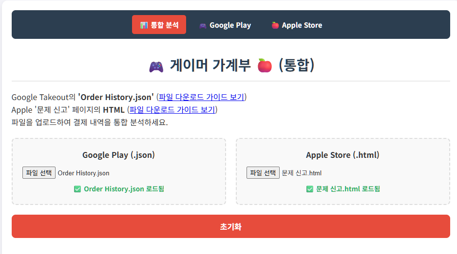

# 🎮 게이머 가계부 (Gamer's Expense Tracker)

**게이머 가계부**는 Google과 Apple 양대 스토어의 결제 내역을 한곳에서 통합하여 분석하고 관리할 수 있도록 돕는 웹 애플리케이션입니다. 이제 흩어져 있던 지출 내역을 하나의 대시보드에서 시각적으로 확인하고 자신의 게임 소비 패턴을 손쉽게 파악할 수 있습니다.



## ✨ 주요 기능

### 📊 **통합 분석 대시보드 (핵심 기능)**

  - **하나의 페이지에서 모든 것을\!**: `Google Play(.json)`와 `Apple Store(.html)` 결제 내역 파일을 한 페이지에 모두 업로드하여 모든 지출을 통합된 데이터로 분석할 수 있습니다.
  - **플랫폼별 독립 분석**: 원한다면 Google 또는 Apple 전용 분석 페이지에서 각 스토어의 결제 내역만 따로 확인할 수도 있습니다.

### 🧾 **상세 분석 기능 (공통)**

  - **💱 다중 통화 지원**:

      - 결제 내역에 포함된 원화(₩), 달러($), 엔(¥) 등 다양한 통화를 자동으로 감지합니다.
      - 감지된 통화 목록이 드롭다운 메뉴로 제공되며, 원하는 통화를 선택하면 모든 요약, 차트, 내역이 해당 통화 기준으로 필터링되어 표시됩니다.

  - **📝 사용자 정의 키워드 관리**:

      - '기타'로 분류된 항목을 원하는 앱으로 재분류할 수 있도록 사용자가 직접 키워드를 추가하고 관리할 수 있습니다.
      - 앱 이름과 관련 키워드를 등록하고, 개별 키워드 또는 앱 전체를 삭제할 수 있습니다.
      - 키워드 목록이 길어질 경우를 대비해 실시간 검색 기능도 제공합니다.
      - (참고: 이 기능은 페이지를 새로고침하면 초기화됩니다.)

  - **💰 전체 결제 내역 요약**: 선택된 통화를 기준으로 모든 스토어의 총결제액과 가장 많은 금액을 지출한 '톱 스펜딩 게임'을 한눈에 보여줍니다.

  - **📈 전체 통계 시각화**: 선택된 통화를 기준으로, 지출액 상위 게임들의 누적 결제액 추이를 기간별(상반기/하반기) 라인 그래프로 시각화합니다.

  - **🔍 게임별 상세 분석**:

      - 월별 결제액 요약 및 상세 내역을 아코디언 UI로 제공합니다.
      - 월별 지출액 변동 추이를 막대그래프로 시각화합니다.
      - 상품명 검색 및 최신순 정렬을 지원하는 전체 결제 내역 테이블을 제공합니다.

  - **⭐ 특정 게임 맞춤 분석 (트릭컬 리바이브)**: '트릭컬 리바이브'를 선택하고 통화가 원화(KRW)일 경우, 주요 과금 상품에 대한 별도 요약 및 전용 필터링 기능을 제공합니다.

### 📱 **모바일 환경 최적화**

  - **반응형 디자인**: 스마트폰과 같은 작은 화면에서도 모든 기능이 자연스럽게 보이고 사용하기 편하도록 디자인되었습니다.
  - **카드형 테이블**: 화면이 좁아지면 '월별 결제 내역'과 '전체 결제 내역'의 테이블이 가로 스크롤 없는 깔끔한 카드 형태로 자동 전환되어 가독성을 높였습니다.

## 📁 프로젝트 구조

유지보수와 확장성을 높이기 위해 파일을 기능별로 분리했습니다.

```
.
├── index.html              # 통합 분석 페이지 (메인)
├── google.html             # Google Play 전용 분석 페이지
├── apple.html              # Apple Store 전용 분석 페이지
├── css/
│   └── style.css           # 모든 페이지에 적용되는 통합 스타일시트
├── js/
│   ├── appKeywords.js      # 게임 이름 분류를 위한 키워드 목록
│   ├── parsers.js          # Google/Apple 데이터 파싱 로직
│   └── main.js             # 데이터 취합 및 UI/이벤트 처리 로직
└── guide/
    ├── apple_guide.html    # Apple Store 구매 내역 다운로드 가이드 페이지
    └── google_guide.html   # Google Play 구매 내역 다운로드 가이드 페이지
```

## 🚀 사용 방법

### 통합 분석 (권장)

1.  `index.html` 파일을 엽니다.
2.  Google Play와 Apple Store 파일 섹션에 각각 `Order History.json` 또는 `문제 신고.html` 파일을 업로드합니다. (하나만 올려도 분석 가능)
3.  두 파일을 모두 올리면 데이터가 자동으로 병합되어 전체 내역이 분석됩니다.

### 플랫폼별 분석

  - Google 내역만 보려면 `google.html`을, Apple 내역만 보려면 `apple.html`을 열고 해당 파일을 업로드합니다.

-----

  - **Google 데이터**: [Google Takeout](https://takeout.google.com/) → 'Google Play 스토어' → `Order History.json` 다운로드
  - **Apple 데이터**: [Apple 문제 신고](https://reportaproblem.apple.com/) → 전체 내역이 보일 때까지 스크롤 → 페이지 저장 (HTML)

## 🛠️ 사용 기술

  - **HTML**
  - **CSS**
  - **JavaScript (Vanilla)**
  - **Chart.js** (데이터 시각화 라이브러리)